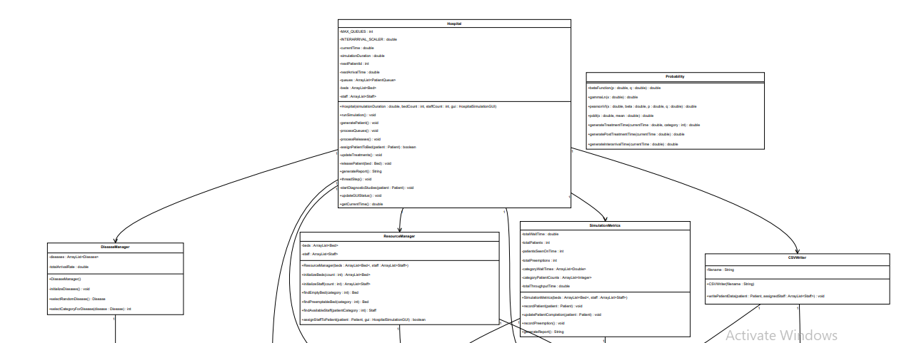
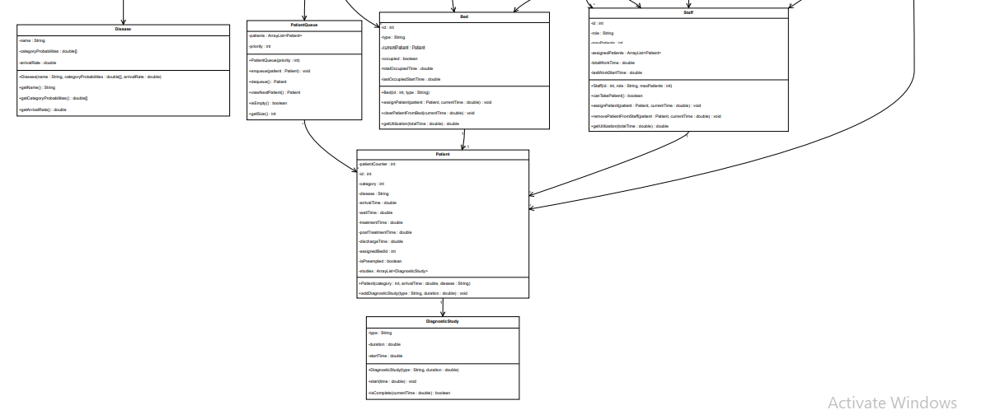
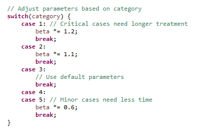
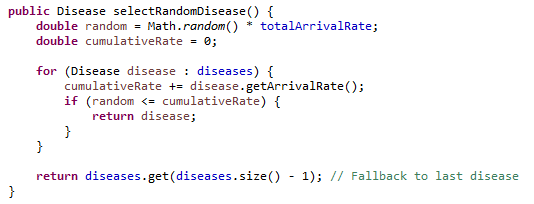
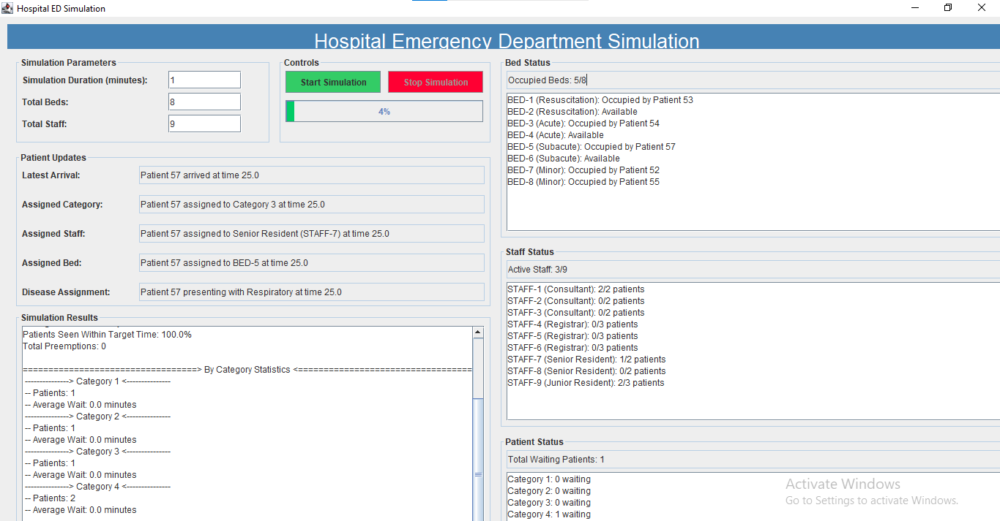
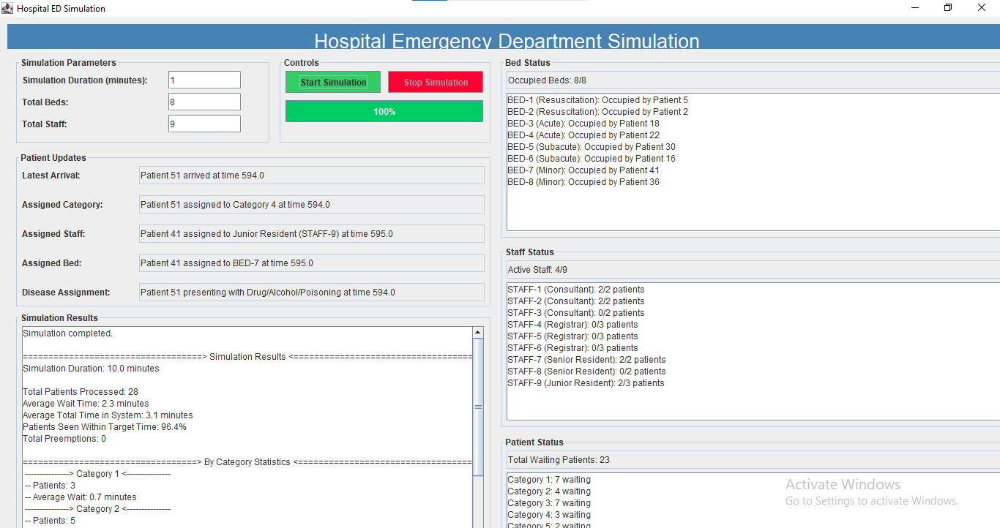
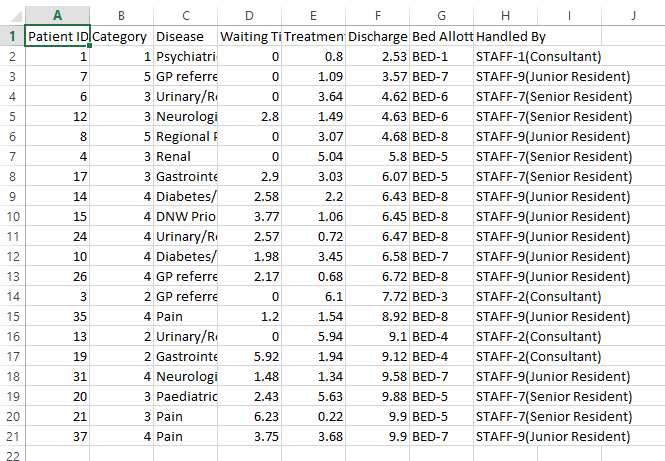

# Project Report for "Hospital ED System" Simulation

---

## Table of Contents

1. [Introduction](#introduction)
2. [Problem Statement](#problem-statement)
3. [Objectives](#objectives)
4. [System Design](#system-design)
5. [Implementation Details](#implementation-details)
6. [Key Features](#key-features)
7. [Results and Outputs](#results-and-outputs)
8. [Challenges and Solutions](#challenges-and-solutions)
9. [Conclusion](#conclusion)

---

## Introduction

The **Hospital Emergency Department (ED) Simulation System** models the fast-paced and critical operations of a hospital ED. It simulates key processes like patient arrivals, triage, resource allocation, treatment, and discharge, all while using principles like encapsulation and composition to create an efficient, modular design.

A hospital ED is where patients with urgent medical needs receive immediate care. Managing this environment involves prioritizing cases, assigning limited resources, and making quick decisions — all essential for saving lives.

Simulating an ED helps improve how these systems work. It allows us to test patient flow, optimize resources like staff and beds, and explore different scenarios without real-world risks. This project demonstrates how programming can tackle real-life challenges while offering a deeper understanding of hospital operations.

---

## Problem Statement

Managing a hospital emergency department (ED) involves addressing unpredictable patient arrivals, varying treatment durations, and the efficient allocation of limited resources like beds and staff. This project tackles these challenges by simulating the ED environment with a focus on patient flow and decision-making processes.

The simulation incorporates **probability distribution functions** to reflect real-world uncertainties and variations. Specifically:

- The **Weibull distribution** models patient interarrival times, capturing the randomness of when patients arrive.
- The **Pearson Type VI distribution** calculates treatment times based on triage categories, ensuring treatment durations align with patient severity.
- The **Post-Discharge Decision Time (PDDT)** function estimates the time a patient requires after treatment before leaving the ED, accounting for recovery or further care needs.

By using these statistical tools, the simulation creates a realistic representation of hospital operations, enabling better insights into optimizing ED workflows and resource management.

---

## Objectives

The main goals of this project are:

- **Simulate Disease Assignment:** Develop a system to assign diseases and treatment categories to patients based on triage protocols.
- **Create a Modular, Scalable System:** Implement an object-oriented programming (OOP) approach for easy system scalability and maintainability.
- **Incorporate Probability Distributions:** Use statistical models like Weibull and Pearson Type VI distributions to realistically simulate patient arrivals, treatment times, and post-discharge decisions.
- **Optimize Resource Management:** Analyze and improve the allocation of hospital resources like beds and staff.
- **Facilitate Decision-Making:** Provide insights into ED operations through realistic simulations, enabling informed decision-making.

---

## System Design

### Class Diagram

### System Level Diagram

The system is structured around the following flow:

- **Patient Entry**
  - Patients enter the ED and are assigned a triage category.
  - Interarrival times are determined using the Weibull Distribution.

- **Triage & Disease Assignment**
  - Triage categories are assigned based on severity.
  - Diseases are randomly assigned using probability distributions for each triage category.

- **Bed and Staff Assignment**
  - The system checks bed availability and assigns the next available bed to a patient.
  - Staff (e.g., doctors) are also assigned to handle the patient.

- **Treatment Simulation**
  - Treatment times are calculated based on disease severity (using Pearson VI Distribution).
  - Treatment is performed virtually, updating patient status.

- **Post-Discharge Simulation**
  - PDDT determines how much additional time the patient spends in the system after treatment.

- **Data Recording**
  - Patient data (e.g., waiting time, treatment time, staff handling) is saved to a CSV file after discharge.
  - Patients still waiting are recorded at the end of the simulation.

---

## Implementation Details

**Programming Language:**
The project was implemented in **Java**, chosen for its strong object-oriented features, reliability, and support for concurrent processing, which is essential for a simulation involving multiple interacting entities.

### Application of OOP Principles

**Encapsulation:**
- Data related to patients, staff, and beds were encapsulated within their respective classes. This ensured that the internal states of these objects were only accessible through well-defined methods, improving modularity and maintainability.
- Example: The `Patient` class encapsulates attributes like ID, category, disease, and state (e.g., waiting, under treatment).

**Inheritance:**
- Common attributes and behaviors were abstracted into base classes.

**Polymorphism:**
- Methods like `getBedTypeForCategory` handle different types of beds (Resuscitation, Acute, Subacute, Minor) that behave similarly but are used differently based on patient categories.
- Example: Different beds were assigned based on patient categories using polymorphic behavior.

### Key Classes and Methods

- **`Patient` Class:** Calculates inter-arrival time, treatment time, and post-discharge decision time for patients.
- **`Staff` Class:** Assigns staff to patients based on their category.
- **`CSVWriter` Class:** Manages data recording, ensuring complete patient records are saved only after discharge.
- **`HospitalSimulationGUI` Class:** Manages the core simulation, including patient arrival, staff assignment, and the flow of patients through the system.

### Integration of Probability Distribution Functions

**Weibull Distribution (Interarrival Times):**

$$f(x) = \frac{\alpha}{\beta}\left(\frac{x}{\beta}\right)^{\alpha-1} e^{-(x/\beta)^\alpha}$$

Constants:
- α = 180 (scale parameter)
- β = 0.914 (shape parameter)

Used to simulate the time intervals between patient arrivals.

**Pearson Type VI Distribution (Treatment Times):**

$$f(x) = \frac{(x/\beta)^{p-1}}{\beta \cdot [1 + (x/\beta)]^{p+q} \cdot B(p,q)}$$

Constants:
- β = 355, p = 1.64, q = 5.12

Used to simulate the duration of treatment for patients based on category.

**Post-Discharge Decision Time (PDDT):**

$$f(x) = \frac{1}{\mu} e^{-x/\mu}$$

Constants:
- μ = 156

Used to determine the time patients require before being fully discharged.

### Additional Value Details

**Category-Based Treatment Scaling:**

- Patients in critical categories had shorter treatment time distributions, with lower β.
- Non-critical patients had longer distributions, modeled with higher β.

The combination of Java's OOP principles and statistical functions allowed the system to model realistic workflows in a hospital ED, providing insights into resource allocation and patient flow.

---

## Key Features

**Randomized Disease Assignment Based on Triage:**

**Use of OOP Principles for Modular Design:**

The system leverages Data Encapsulation and Composition to ensure each component (e.g., Patient, Staff, Bed) is self-contained and interacts seamlessly with others. This modular structure makes the system intuitive to develop, debug, and scale.

**Extensibility for Adding New Triage Categories or Diseases:**
New triage categories or diseases can be added easily by updating the disease assignment logic or adding subclasses without disrupting the core simulation logic.

**Graphical/Console-Based Simulation Results:**

---

## Results and Outputs

*Completed Simulation on GUI*

*Record of discharged patients saved in CSV File*

---

## Challenges and Solutions

**1. Implementing Probability Distributions:**
One of the main challenges was accurately implementing probability distribution functions like Weibull and Pearson Type VI to simulate patient interarrival times and treatment durations. Ensuring these distributions reflected real-world scenarios required extensive research and testing.

**Solution:** We utilized Java's statistical libraries and validated outputs by comparing them to healthcare benchmarks and expected distributions.

**2. Debugging Complex Interactions:**
With multiple components (patients, staff, beds, and processes) interacting dynamically, debugging issues like incomplete data handling or incorrect assignments was a challenge.

**Solution:** A systematic approach to testing individual components and logging every stage of data processing helped identify and resolve errors efficiently.

**3. Maintaining Data Consistency:**
Ensuring patient data remained consistent across different stages (arrival, treatment, discharge) was difficult due to asynchronous updates.

**Solution:** A central record-keeping system with buffers was implemented to consolidate patient data and ensure updates were applied sequentially.

---

## Conclusion

This project successfully developed a hospital Emergency Department simulation system that models patient flow, disease assignment, and resource allocation using Object-Oriented Programming principles and probability distributions. It offers a modular, scalable, and realistic approach to understanding the complexities of emergency healthcare systems.

Key achievements include implementing randomized disease assignment, leveraging distributions like Weibull and Pearson Type VI for patient arrival and treatment times, and creating a system that is both extensible and intuitive.

Looking ahead, the system could be enhanced by incorporating real-time patient data and predictive analytics powered by machine learning to improve decision-making. Additionally, advanced visualization tools or integration with hospital management software could make the simulation even more valuable for research and training purposes.
